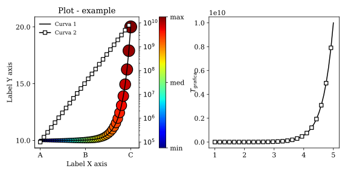
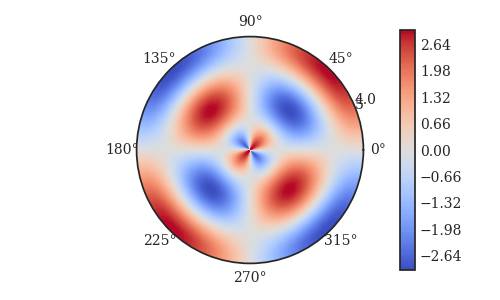

# Plots-in-python---A-review
Quick review of Matplotlib library to create basic and advanced plots

### Example 1: Scatter plots, line plots, subplots, colormaps, and other concepts

### Example 2: Contour plots to visualize 3 and more variables in a 2D plot

